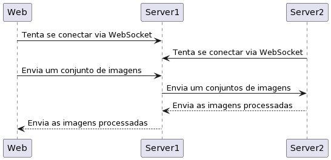

# Websocket POC

## Objetivos

Utilizar websockets para a realização de um teste de envio de imagens para processamento em um servidor
terceiro usando Node.js

## Esquema visual



## Como rodar

```bash
npm install # Instala as dependências
npm run web # Executar a aplicação web
npm run s1 # Executar o servidor 1
npm run s2 # Executar o servidor 2
```

> Deve-se executar as três aplicações independentemente. Logo, é necessário cria três instâncias diferentes do terminal para realizar o teste.
